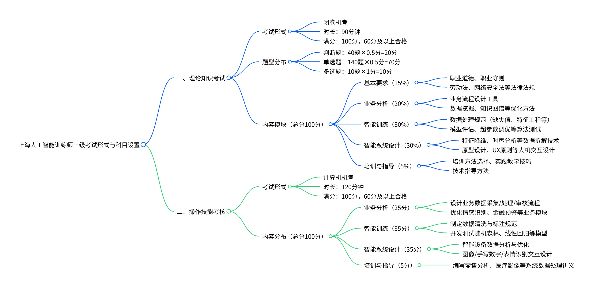
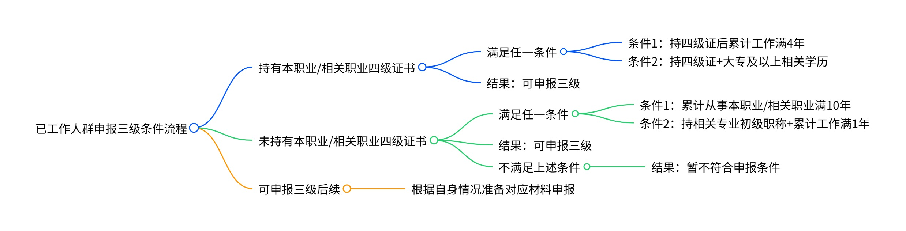

## 概览（思维导图）
以下思维导图梳理全文核心框架，助力快速掌握备考关键信息：

<!-- 这是一张图片，ocr 内容为： -->

## 一、上海人工智能训练师三级证书考试概述
### 1.1 证书基本信息与价值
+ 人工智能训练师是经人力资源社会保障部认定的新职业，已被列入上海市技能人才紧缺职业（工种）目录。作为使用智能训练软件，在人工智能产品实际使用过程中进行数据库管理、算法参数设置、人机交互设计、性能测试跟踪及其他辅助作业的人员，人工智能训练师在当前 AI 技术快速发展的背景下具有重要的职业价值。
+ 人工智能训练师职业共设五个等级，从五级（初级工）到一级（高级技师），三级 / 高级工是可直接报考的最高等级。该职业包含三个职业方向：数据标注员、人工智能算法测试员、人工智能数字人训练师，这为从业者提供了多元化的发展路径。
+ 对于个人报名者而言，上海人工智能训练师三级证书具有多重价值。首先，该证书可用于上海居住证积分 60 分，这对于在沪工作生活的人员具有重要意义。其次，根据最新政策，获得三级证书的在职人员可申请 2600 元职业技能提升补贴，失业人员可申请 3250 元补贴，工会会员还可额外获得 800 元补贴。此外，该证书在行业内具有广泛认可度，是求职、晋升的重要资质证明，特别是在当前 AI 技术快速发展的背景下，掌握人工智能训练师技能的人才备受企业青睐。

### 1.2 考试形式与科目设置
<!-- 这是一张图片，ocr 内容为： -->

### 1.3 申报条件详解
根据上海市相关规定，已工作人群申报人工智能训练师三级/高级工，需满足以下条件之一，判断逻辑如下：

<!-- 这是一张图片，ocr 内容为： -->

> **关键说明[申报考试条件]**
>

符合以下条件之一可申报三级/高级：

1、累计从事本职业或相关职业工作满10年可申报三级/高级。

2、取得本职业或相关职业四级/中级职业资格证书后，累计从事本职业或相关职业工作满4年。

3、取得经评估论证的高等职业学校、专科及以上普通高等学校本专业或相关专业的毕业证书（含在读应届毕业生）。

① **相关专业**：

+ 包装工程、人工智能、材料科学与工程类、人工智能(专硕)、测控技术与仪器、人工智能(卓越人才试点班) 、船舶与海洋工程、人工智能工程技术、大数据技术、人工智能技术应用、大数据技术与工程(专硕)、软件工程、大数据与会计、视觉传达设计、大数据与会计（五年一贯制）、数据科学与大数据技术、电气工程及其自动化、数学与应用数学、电气工程与智能控制、数字媒体技术、电子科学与技术、数字媒体技术（电竞内容制作）、电子商务、数字媒体技术（五年一贯制）、电子信息、天文学、电子信息工程、通信工程、电子信息科学、通信与信息系统、电子与计算机工程、统计学、工程力学、土木工程、工业工程、网络工程、工业设计、网络空间安全、光电信息科学与工程、微电子科学与工程、光学工程、物理学-电子科学与技术、航空航天工程、物联网工程技术、呼吸治疗技术、物联网应用技术、护理、物流工程、化学、物流工程与管理(专硕)、环境科学与工程、新一代电子信息技术(含量子技术等)(专硕)、机电一体化技术、信号与信息处理 、机械电子工程、信息安全、机械工程、信息管理与信息系统、机械制造及其自动化、信息与计算科学、计算机技术、信息与通信工程、计算机科学与技术、虚拟现实技术应用、计算机应用技术、学前教育、建筑电气与智能化、学前教育（五年一贯制）、健身指导与管理、仪器科学与技术、金融学-计算机科学与技术、移动应用开发、控制工程、智能科学与技术、控制科学与工程、控制理论与控制工程、能源与动力工程、智能控制技术、智能制造工程、自动化、市场营销专业。

② **相关职业**：

+ 人工智能工程技术技术人员、呼叫中心服务员、电子商务师等职业。

### 1.4 上海地区认证机构介绍
上海地区共有三家官方认定机构负责人工智能训练师认证工作：

+ **上海市人工智能行业协会**是最主要的认证机构之一。该协会是受上海市经济和信息化委员会业务指导，在上海市民政局管理监督下成立的唯一代表上海市人工智能行业的非营利社会团体，由仪电集团等单位共同发起，于 2020 世界人工智能大会期间正式揭牌，汇聚了 700 余家成员单位。协会承担人工智能训练师五级至一级的全部等级认定工作。
+ **上海交通大学**作为 "双一流" 建设高校中首家社会化培训评价组织，面向全社会开展人工智能训练师（四级、三级）职业技能等级认定工作。值得注意的是，目前上海市仅上海交通大学获得人工智能训练师高阶段技师 / 二级、高级技师 / 一级的认定资格，这充分体现了其在人工智能领域的专业水平。
+ **上海市计算技术研究所有限公司**是第三家官方认定机构，同样具备开展人工智能训练师职业技能等级认定的资质。

对于个人报名者，建议优先选择上海市人工智能行业协会或上海交通大学作为认证机构，因为这两家机构的知名度和认可度更高，且培训资源更加丰富。

## 二、个人报名流程详解
### 2.1 报名前准备工作
作为个人报名者，在正式报名前需要做好充分的准备工作。首先，需要对照申报条件进行自我评估，确定自己符合哪一条申报条件。建议准备以下材料清单：

**基础材料**：

+ 身份证正反面（原件及复印件）
+ 学历证书 / 学信网验证报告（需与国家标准的相关专业对口和大类相似）
+ 半年内 2 寸白底彩色电子证件照（规格符合报名系统要求）
+ 一寸白底证件照片 1 张

**工作年限证明材料**：

+ 满足年限的社保单（可通过随申办 APP 下载）
+ 劳动合同或岗位工作证明
+ 如按工作年限报名，需要累计 120 个月（10 年）的社保缴纳记录

**其他材料**：

+ 本人签名的诚信承诺书
+ 职业技能等级认定报名表（可从官网下载或由培训机构提供）
+ 如涉及职称申报，需提供人力资源社会保障部门核发的对应职称证书
+ 如已有四级证书，需提供证书扫描件

特别提醒，材料准备务必齐全，材料不齐会直接导致审核不通过。建议提前在随申办 APP 上下载好社保缴纳记录，确保工作年限证明的完整性。同时，学历证书需要进行学信网验证，建议提前在学信网申请学历验证报告。

### 2.2 报名方式与渠道
上海人工智能训练师三级证书的报名方式主要有两种：**个人直接报名**和**通过培训机构报名**。

**个人直接报名**的具体流程如下：

1. **查看报名公告**：关注上海市人社局 12333 官网（[rsj.sh.gov.cn/index.html](https://rsj.sh.gov.cn/index.html)）、上海交通大学（[gjzs.sjtu.edu.cn/skill](https://gjzs.sjtu.edu.cn/skill)）、上海计算机研究所（[https://www.sh-sict.com/zxzx/gstz/）、](https://www.sh-sict.com/zxzx/gstz/）、) 人工智能行业协会（[http://www.sh-aia.com/dynamics/detail538.htm）](http://www.sh-aia.com/dynamics/detail538.htm）) 等官方渠道发布的报名公告。
2. **网上报名**：通过各区就业促进中心窗口电话申请。具体操作步骤：
    - 上海市人工智能行业协会 联系电话： 62037717 
    - 上海市计算技术研究所有限公司 电话：021-62520070
    - 上海交通大学 电话：021-62933821
3. **现场报名**：也可以选择前往各认证机构的指定报名点进行现场报名。报名地址包括：
+ 上海市人工智能行业协会：浦东新区世博村路 231 号市府大厦 306 室等多个受理点
+ 上海交通大学：长宁校区法华镇路 535 号主楼 216 室，职业技能等级认定办公室
1. **材料审核**：提交身份证、学历证明、工作证明等相关材料，等待审核。
2. **缴费确认**：审核通过后缴纳报名费。

**通过培训机构报名**的优势在于培训机构会提供全程指导，包括材料审核、报名提交、考试安排等，通过率更高。但需要注意选择正规的培训机构，避免被骗。

对于个人报名者，建议优先选择通过培训机构报名，因为这样可以获得更多的支持和指导，特别是对于自学备考的人员来说，培训机构提供的学习资料和考前辅导会很有帮助。

### 2.3 报名时间与费用
**报名时间**方面，上海人工智能训练师考试每年分多个批次进行，通常在 1 月、3 月、5 月、7 月、9 月、11 月等月份安排考试。具体报名时间需要关注官方发布的报名公告。

**考试费用**方面，不同机构略有差异，上海普遍标准为：

+ 培训费：2100 元（含课程 + 题库 + 实操）
+ 考务费：500 元（按评价机构公告为准）

部分培训机构的收费标准为总费用 2000 元，其中培训费 1500 元，考核费 500 元。需要注意的是，考试费用一般不包含补考费用，补考费用与正考费用一致，按补考模块收费。

### 2.4 资格审核流程
资格审核是报名流程中的关键环节，审核时间一般为 5-7 个工作日。审核流程如下：

1. **材料初审**：报名点工作人员对提交的材料进行初步审核，检查材料是否齐全、规范。
2. **信息核验**：审核人员会核验学历证书、工作年限证明、社保记录等关键信息的真实性。
3. **条件匹配**：对照申报条件，确认报名者是否符合三级证书的申报要求。
4. **审核结果通知**：
+ 审核通过：通常不会短信通知，需自行登录报名系统查询
+ 审核不通过：会收到短信通知原因，需要修改或补充材料后重新提交

需要特别注意的是，审核不通过的常见原因包括：材料不齐全（占比 38%）、技术描述不清（占比 27%）、格式错误（占比 5%）等。因此，在准备材料时务必仔细核对，确保材料的完整性和准确性。

审核通过后，需要在规定时间内完成缴费，缴费成功后才算正式完成报名。缴费完成后，考试前 5 个工作日可通过上海市人工智能行业协会官网（[http://www.sh-aia.com](http://www.sh-aia.com)）下载准考证。

## 三、自学备考指南
### 3.1 学习路径规划
对于选择自学的个人报名者，制定合理的学习路径至关重要。根据考试大纲和难度特点，建议采用 "基础 - 进阶 - 实战 - 冲刺" 的四阶段学习模式。

**第一阶段：基础入门（2-3 周）**

这一阶段的主要任务是建立对人工智能训练师职业的基本认知，掌握必备的基础知识。学习内容包括：

1. **人工智能基础概念**：了解人工智能的定义、发展历程、主要技术分支（机器学习、深度学习、自然语言处理等）
2. **编程语言基础**：重点学习 Python 语言，包括变量、数据类型、控制语句、函数、类等基础语法
3. **数据处理基础**：掌握数据采集、清洗、标注的基本概念和方法
4. **工具软件使用**：熟悉 Excel、SQL 等基础数据处理工具

**第二阶段：进阶学习（3-4 周）**

这一阶段需要深入学习考试大纲中的核心内容，重点掌握理论知识和基本技能。学习内容包括：

1. **业务分析模块（20% 权重）**：
+ 学习业务流程设计方法和工具
+ 掌握数据采集、处理、存储、治理的流程
+ 了解数据挖掘、知识图谱、聚类分析等方法
1. **智能训练模块（30% 权重）**：
+ 深入学习数据处理规范（缺失值处理、特征工程、数据标注）
+ 掌握机器学习基础算法（线性回归、决策树、随机森林等）
+ 了解模型评估指标（准确率、召回率、F1 分数、AUC-ROC 等）
+ 学习超参数调优和容器化技术
1. **智能系统设计模块（30% 权重）**：
+ 学习数据拆解与分析技术（特征降维、时序分析、网络分析）
+ 掌握人机交互设计原则和方法
+ 了解原型设计、多模态交互、UX 设计原则
1. **培训与指导模块（5% 权重）**：
+ 了解培训方法和教学技巧
+ 学习技术文档编写方法

**第三阶段：实战练习（2-3 周）**

这一阶段的重点是通过实践项目巩固所学知识，提升实际操作能力。建议完成以下实践任务：

1. **数据处理实战**：
+ 下载公开数据集（如鸢尾花数据集、MNIST 手写数字数据集）
+ 练习数据清洗、特征工程、数据标注等操作
+ 使用 Python 完成数据处理全流程
1. **模型训练实战**：
+ 使用 Scikit-learn 库实现机器学习算法
+ 练习模型训练、评估、调优的完整流程
+ 掌握不同评估指标的计算和应用
1. **系统设计实战**：
+ 设计简单的智能系统架构
+ 练习人机交互流程设计
+ 完成系统需求分析和设计文档
1. **业务案例分析**：
+ 分析电商用户行为数据
+ 设计智能推荐系统方案
+ 编写业务流程设计文档

**第四阶段：冲刺复习（1-2 周）**

这一阶段主要是查漏补缺，强化记忆，熟悉考试形式。重点任务包括：

1. **理论知识强化**：
+ 背诵重点概念和公式
+ 复习错题和难点
+ 进行模拟考试练习
1. **实操技能巩固**：
+ 练习操作技能题库中的题目
+ 熟悉考试系统的操作流程
+ 掌握代码编写和文档撰写规范
1. **应试技巧掌握**：
+ 熟悉机考系统的使用方法
+ 掌握时间分配策略
+ 了解评分标准和答题技巧

### 3.2 学习资源推荐
对于自学备考的个人报名者，选择合适的学习资源至关重要。以下是经过筛选的优质学习资源推荐：

**官方资源**：

1. **上海市人工智能行业协会官网**（[http://www.sh-aia.com](http://www.sh-aia.com)）
+ 提供考试大纲、样题、复习资料下载
+ 发布最新的考试信息和政策动态
+ 有在线答疑功能，可咨询考试相关问题
1. **上海交通大学技能培训官网**（[https://gjzs.sjtu.edu.cn/skill](https://gjzs.sjtu.edu.cn/skill)）
+ 提供官方教材和培训视频
+ 有历年真题和模拟试题
+ 提供在线学习平台
1. **国家职业技能标准**
+ 《人工智能训练师国家职业技能标准》（2021 版）PDF，可免费下载
+ 这是考试的根本依据，必须认真研读

**教材推荐**：

1. **官方指定教材**：
+ 《人工智能训练师》（三级）职业技能等级认定培训教材
+ 内容紧扣考试大纲，权威性强
2. **考试辅导书**：
+ 《人工智能训练师三级考试辅导教程》
+ 《人工智能训练师理论知识速记手册》
+ 《人工智能训练师操作技能题库》
3. 部门内题库总结

> **分享整理三级训练师材料如下：**
>
> **1、官网通知以及材料：**[**https://gjzs.sjtu.edu.cn/skill**](https://gjzs.sjtu.edu.cn/skill)
>
> **2、个人整理资料：百度云链接: **[**https://pan.baidu.com/s/1Uv7ukq_jN0c4V04cZ4DGlA**](https://pan.baidu.com/s/1Uv7ukq_jN0c4V04cZ4DGlA)** 提取码: mt27**
>
> **如过期，可联系liu.xiangqian**
>

### 3.3 备考时间安排建议
根据考试难度和内容量，建议备考周期为**2-3 个月**，具体时间安排如下：

| 阶段 | 时间安排 | 学习重点 | 每日学习时间 | 主要任务 |
| --- | --- | --- | --- | --- |
| 基础入门 | 第 1-2 周 | 建立 AI 基础认知 | 2-3 小时 | 学习 Python 基础、AI 概念、数据处理基础 |
| 进阶学习 | 第 3-6 周 | 系统学习考试内容 | 3-4 小时 | 深入学习四大模块理论知识，完成基础练习 |
| 实战练习 | 第 7-9 周 | 提升实操能力 | 4-5 小时 | 完成数据处理、模型训练、系统设计等项目 |
| 冲刺复习 | 第 10-11 周 | 强化记忆和应试技巧 | 3-4 小时 | 模拟考试、错题复习、查漏补缺 |
| 考前调整 | 第 12 周 | 保持状态 | 2 小时 | 复习重点、调整心态、熟悉考场 |

1. **制定学习目标**：每周设定具体的学习目标，如 "掌握数据处理规范"、"完成 3 个机器学习算法实现" 等。
2. **进度记录**：使用学习打卡 APP 或 Excel 表格记录每日学习内容和进度，确保按计划推进。
3. **自我测试**：每完成一个模块，进行一次自测，检验学习效果。
4. **调整优化**：根据测试结果和学习进度，及时调整学习计划，重点攻克薄弱环节。

## 四、考试内容详解
### 4.1 理论知识考试重点
理论知识考试占总分的 100 分，需要达到 60 分以上才能及格。根据考试大纲，重点内容分布如下：

**基本要求（15%，约 15 分）**

1. **职业道德和职业守则**：
+ 人工智能训练师的职业素养要求
+ 职业技能标准和规范
+ 行业道德准则和行为规范
2. **法律法规知识**：

**业务分析（20%，约 20 分）**

1. **业务流程设计工具**：
+ 数据采集工具：爬虫、API 接口、传感器等
+ 数据处理工具：ETL 工具、数据集成平台
+ 数据存储工具：关系型数据库、NoSQL 数据库、数据仓库
+ 数据治理工具：数据质量管理工具、元数据管理工具
2. **业务模块优化方法**：
+ 数据挖掘技术：关联规则、分类、聚类等
+ 知识图谱构建和应用
+ 聚类分析在业务场景中的应用
+ 业务流程优化的方法论

**智能训练（30%，约 30 分）**

1. **数据处理规范**：
+ 缺失值处理方法：删除法、插补法、预测法
+ 特征工程技术：特征选择、特征提取、特征变换
+ 数据标注规范：分类标注、序列标注、边界标注
+ 数据质量控制方法和指标
2. **算法测试和模型评估**：
+ 常用评估指标：准确率、精确率、召回率、F1 分数、AUC-ROC
+ 超参数调优方法：网格搜索、随机搜索、贝叶斯优化
+ 容器化技术：Docker 基础概念和使用
+ 模型性能优化方法

**智能系统设计（30%，约 30 分）**

1. **数据分析技术**：
+ 特征降维算法：PCA、LDA、t-SNE
+ 时序分析方法：时间序列预测、周期性分析
+ 网络分析技术：社交网络分析、知识图谱分析
2. **人机交互设计**：
+ 原型设计工具：Axure、Sketch、Figma
+ 多模态交互技术：语音、手势、视觉交互
+ UX 设计原则和最佳实践
+ 交互流程设计方法

**培训与指导（5%，约 5 分）**

1. **培训方法和技巧**：
+ 成人学习理论和特点
+ 培训需求分析方法
+ 培训课程设计原理
2. **技术指导方法**：
+ 一对一指导技巧
+ 团队培训方法
+ 问题诊断和解决流程

### 4.2 操作技能考核要点
操作技能考核占总分的 100 分，是考试中难度较大的部分，需要重点准备。根据样题和考试经验，主要考核内容包括：

**业务分析（25 分）**

1. **业务数据流程设计**：
+ 案例：设计电商用户行为分析的数据采集、处理、审核流程
+ 要求：理解业务需求，设计完整的数据处理链路
+ 重点：流程的合理性、可操作性、数据质量保障措施
2. **业务模块优化**：
+ 案例：优化智能客服系统的对话流程
+ 要求：识别问题、分析原因、提出优化方案
+ 重点：问题诊断的准确性、优化方案的创新性和可行性

**智能训练（35 分）**

1. **数据处理规范制定**：
+ 案例：制定医疗影像数据的标注规范
+ 要求：根据业务场景，设计数据标注标准和流程
+ 重点：标注规则的完整性、一致性、可执行性
2. **模型开发与测试**：
+ 案例：使用 Python 实现一个简单的分类模型（如随机森林）
+ 要求：完成数据预处理、模型训练、评估、调优全流程
+ 重点：代码的规范性、模型的性能、结果的可解释性

**智能系统设计（35 分）**

1. **数据分析与优化**：
+ 案例：分析智能家居环境数据，提出节能优化方案
+ 要求：进行数据探索、分析趋势、提出改进建议
+ 重点：分析方法的科学性、建议的实用性
2. **人机交互流程设计**：
+ 案例：设计智能手环的用户交互流程
+ 要求：考虑用户体验、功能实现、技术可行性
+ 重点：流程的易用性、美观性、功能性

**培训与指导（5 分）**

1. **培训讲义编写**：
+ 案例：编写 AI 基础概念的培训讲义
+ 要求：内容准确、结构清晰、易于理解
+ 重点：知识的准确性、表达的通俗性

### 4.3 考试技巧与注意事项
**理论考试技巧**：

1. **时间分配**：
+ 判断题（40 题）：建议 15 分钟
+ 单选题（140 题）：建议 60 分钟
+ 多选题（10 题）：建议 10 分钟
+ 检查时间：建议 5 分钟
2. **答题策略**：
+ 先易后难，遇到不会的题目先跳过
+ 多选题宁可少选，不可错选
+ 注意审题，特别是 "不正确"、"不属于" 等关键词
3. **复习重点**：
+ 智能训练和智能系统设计模块占比最大（各 30%），需要重点复习
+ 基本要求部分虽然占比小（15%），但都是记忆性内容，容易得分
+ 业务分析部分需要理解原理，不能死记硬背

**实操考试技巧**：

1. **环境熟悉**：
+ 提前了解考试系统的操作界面
+ 熟悉常用软件（如 Excel、Python IDE）的使用
+ 掌握文件保存和提交的规范
2. **时间管理**：
+ 总共 120 分钟，建议分配如下：
+ 业务分析（25 分）：30 分钟
+ 智能训练（35 分）：45 分钟
+ 智能系统设计（35 分）：40 分钟
+ 培训与指导（5 分）：5 分钟
+ 检查和提交：10 分钟
3. **答题要点**：
+ 代码题要注意格式规范，添加必要的注释
+ 设计题要图文并茂，使用流程图、表格等辅助表达
+ 所有文件要按要求命名和保存，避免因格式错误失分

**特别注意事项**：

1. **考试纪律**：
+ 提前 30 分钟到达考场
+ 携带身份证和准考证原件
+ 禁止携带电子设备、书籍等资料
2. **系统操作**：
+ 登录系统后仔细核对个人信息
+ 注意保存进度，避免因系统故障丢失
+ 考试过程中遇到问题及时举手示意监考老师
3. **答题规范**：
+ 所有答案必须在指定位置填写
+ 代码题需要上传多种格式（截图 + TXT+HTML+ipynb）
+ 论述题直接在考试系统里输入，不需要上传 word 文档
4. **心态调整**：
+ 保持冷静，不要因为题目难而慌张
+ 相信自己的准备，认真审题，仔细作答
+ 即使遇到不会的题目，也要尽量写出相关内容

## 五、考试经验分享与常见问题
### 5.1 历年通过率分析
根据官方统计数据，上海人工智能训练师三级证书考试的通过率情况如下：

+ 总体通过率：约 80-85%
+ 理论考试通过率：96.9%
+ 实操考试通过率：79.7%
+ 不同机构通过率：最高班级一次性通过率 92%，最低通过率 68%

从数据可以看出，理论考试的通过率明显高于实操考试，说明实操技能是考试的主要难点。同时，不同培训机构的通过率差异较大，这与培训质量、师资水平、学员基础等因素有关。

对于自学考生，通过率可能会略低于平均水平，因此需要更加努力地准备，特别是在实操技能方面。建议多进行实际操作练习，熟悉考试系统和题型。

### 5.2 考生经验总结
根据历年考生的经验分享，以下是一些实用的备考建议：

**关于理论考试**：

1. **刷题策略**：
+ 有考生反映，理论考试题目多来自官方题库，建议多刷真题
+ 重点掌握高频考点，如机器学习基础概念、数据处理方法等
+ 不要只记答案，要理解知识点的原理
1. **记忆技巧**：
+ 使用思维导图整理知识点，形成知识体系
+ 制作记忆卡片，利用碎片时间复习
+ 结合实际案例理解抽象概念
1. **考试技巧**：
+ 考试时注意时间分配，不要在难题上花费过多时间
+ 多选题要仔细审题，注意 "全选" 的情况
+ 判断题要注意绝对化表述，通常是错误的

**关于实操考试**：

1. **练习重点**：
+ 数据处理规范制定：理解 "为什么要有这些规范"，而不是死记硬背
+ 算法测试：掌握 5 种以上评估指标，知道什么场景用什么指标
+ 系统设计：准备万能模板，如业务流程设计的标准框架
1. **代码练习**：
+ 重点练习 Python 基础语法、数据处理库（Pandas、NumPy）
+ 掌握机器学习库（Scikit-learn）的基本使用
+ 熟悉数据可视化（Matplotlib、Seaborn）
1. **时间分配**：
+ 建议按分值分配时间：智能训练（35 分）分配 40 分钟，智能系统设计（35 分）分配 40 分钟，业务分析（25 分）分配 30 分钟，培训指导（5 分）分配 10 分钟
1. **注意事项**：
+ 所有操作要保存，避免因疏忽导致失分
+ 代码要规范，添加注释
+ 设计题要清晰，使用标准符号

### 5.3 常见问题解答
**Q1：零基础可以报考三级证书吗？**

A：理论上可以，但难度较大。三级证书要求有一定的 AI 基础和工作经验。如果是零基础，建议先从五级或四级开始，或者投入更多时间进行系统学习。根据经验，零基础考生备考三级证书需要 3-4 个月的密集学习。

**Q2：自学需要多长时间准备？**

A：一般建议 2-3 个月，具体时间取决于个人基础。如果有编程基础和相关工作经验，2 个月可能够；如果基础薄弱，建议准备 3 个月以上。关键是要制定合理的学习计划并严格执行。

**Q3：考试难度如何？主要难点在哪里？**

A：考试难度中等偏易，总体通过率约 80%。主要难点在于：

+ 实操考试：需要实际动手能力，很多考生因为缺乏实践经验而失分
+ 知识点覆盖面广：需要掌握从数据处理到模型训练的全流程
+ 时间紧张：实操考试 120 分钟要完成多道大题，对熟练度要求高

**Q4：如何选择培训机构？**

A：选择培训机构时要注意：

+ 查看资质：是否有官方授权
+ 了解师资：教师是否有 AI 行业经验
+ 试听课程：了解教学质量
+ 比较价格：不要只看价格，要综合考虑性价比

**Q5：考试未通过怎么办？**

A：如果考试未通过，可以申请补考。注意事项：

+ 成绩有效期：五级、四级、三级成绩有效期为 2 年，二级、一级为 3 年
+ 补考费用：与正考费用相同，按模块收费
+ 补考准备：分析失败原因，有针对性地加强薄弱环节

**Q6：证书有什么用？值得考吗？**

A：证书的价值体现在：

+ 上海居住证积分 60 分
+ 政府补贴 2600-3250 元
+ 提升就业竞争力，薪资涨幅可达 20-30%
+ 系统学习 AI 知识，提升职业技能

对于在上海工作、有意进入 AI 行业或提升技能的人员，这个证书是值得考的。

## 六、总结与展望
### 6.1 证书价值总结
上海人工智能训练师三级证书作为国家认可的职业技能等级证书，在当前 AI 技术快速发展的时代背景下具有重要价值。

**政策价值**：该证书被列入上海市急需紧缺高技能人才职业目录，可用于上海居住证积分 60 分，这对于在沪工作生活的人员具有重要意义。同时，获得证书后可申请职业技能提升补贴，进一步降低了考证成本。

**职业发展价值**：随着 AI 技术在各行业的广泛应用，企业对人工智能训练师的需求持续上升。该证书不仅是进入 AI 行业的敲门砖，也是在职人员提升技能、获得晋升的重要资质。根据市场调研，持有该证书的人员薪资普遍提升 20-30%。

**技能提升价值**：通过系统学习和备考，考生能够全面掌握从数据采集、处理到模型训练、系统设计的全流程技能，这些技能在当前数字化转型的大趋势下具有广泛的应用前景。

### 6.2 未来发展趋势
人工智能训练师职业的发展前景十分广阔：

1. **市场需求持续增长**：AI 技术正在渗透到各个行业，从金融、医疗到零售、制造，每个行业都需要 AI 训练师来构建和优化 AI 系统。
2. **职业发展路径清晰**：从三级证书开始，可以逐步晋升到二级（技师）、一级（高级技师），职业发展空间大。同时，还可以向 AI 产品经理、数据科学家、算法工程师等方向转型。
3. **技能要求不断提升**：随着大模型、多模态 AI 等新技术的发展，对 AI 训练师的技能要求也在不断提升。未来需要掌握更多前沿技术，如大模型微调、多模态交互设计等。
4. **行业应用深化**：AI 技术在垂直行业的应用将越来越深入，需要既懂技术又懂行业的复合型人才。

### 6.3 给自学考生的建议
作为选择自学的个人报名者，你面临着更大的挑战，但同时也有更多的灵活性。以下是最后的建议：

1. **制定计划并坚持执行**：自学最大的挑战是自律，建议制定详细的学习计划，每天保证 2-3 小时的学习时间。
2. **善用资源**：充分利用官方资源、在线课程、开源项目等学习材料，不要闭门造车。
3. **注重实践**：理论学习固然重要，但实操能力更关键。建议多做项目练习，提升动手能力。
4. **保持信心**：考试难度适中，只要认真准备，通过是大概率事件。相信自己的能力，坚持到底。
5. **长远规划**：不要只盯着考试，要把这次学习作为进入 AI 领域的起点，持续学习和提升。

最后，希望这份指南能够帮助你顺利通过考试。

